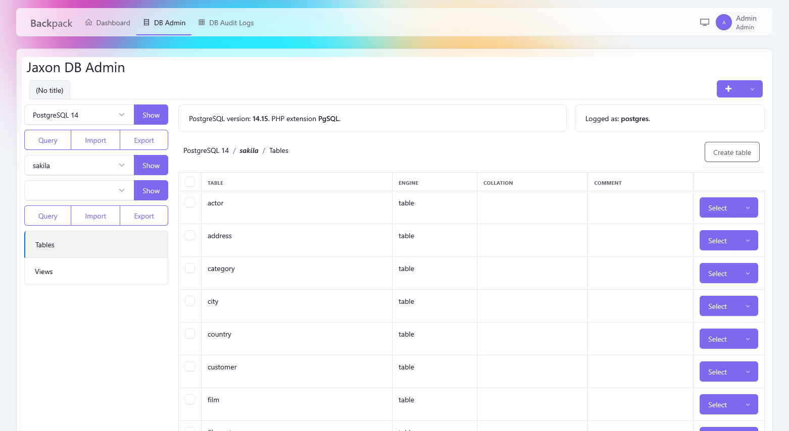
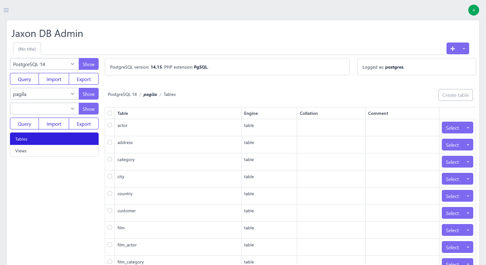
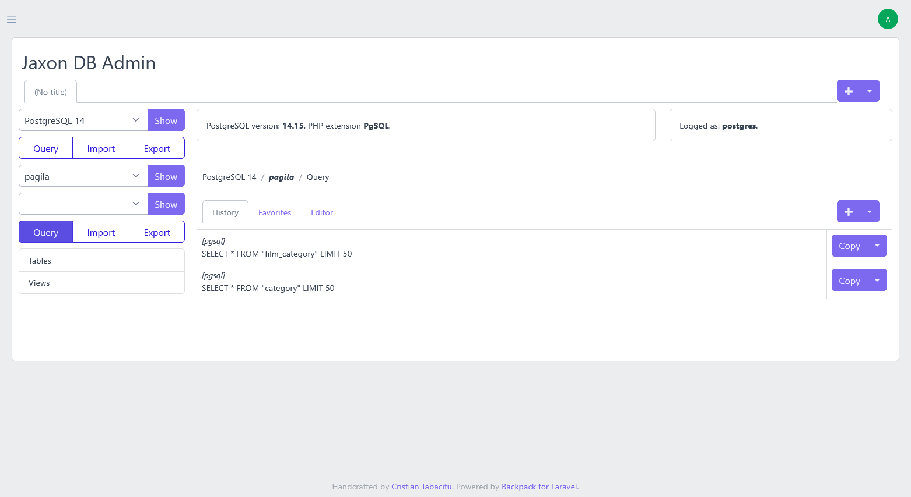
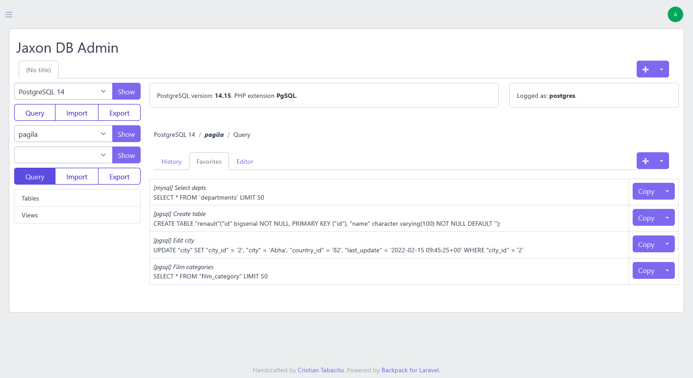

# Jaxon DbAdmin addon for Backpack

**This package installs the [Jaxon DbAdmin](https://github.com/lagdo/jaxon-dbadmin) database manager tool in Backpack.**

[Features](#features) • [Installation](#installation) • [Configuration](#database-access-configuration) • [Query audit](#writing-in-the-query-audit) • [Config readers](#the-database-config-readers) • [Data export](#data-export) • [Data import](#data-import-with-file-upload)

[![Latest Version on Packagist][ico-version]][link-packagist]
[![Total Downloads][ico-downloads]][link-downloads]





## Features

This application and the related packages are still being actively developed, and the provided features are still basic and need improvements.

The following features are currently available:
- Browse servers and databases in multiple tabs.
- Open the query editor in multiple tabs, with query text retention.
- Save and show the query history.
- Save queries in user favorites.
- Read database credentials with an extensible config reader.
- Read database credentials from an [Infisical](https://infisical.com/) server.
- Show tables and views details.
- Query a table.
- Query a view.
- Execute queries in the query editor.
- Use a better editor for SQL queries.
- Import or export data.
- Insert, modify or delete data in a table.
- Create or drop a database.
- Create or alter a table or view.
- Drop a table or view.

## Installation

Install the package with Composer.

``` bash
composer require lagdo/dbadmin-backpack-addon
```

Publish the default `config/jaxon.php` and `config/dbadmin.php` config files.

```bash
php artisan vendor:publish --provider="Lagdo\\Dbadmin\\Backpack\\DbAdminServiceProvider"
```

## Database access configuration

Jaxon DbAdmin supports 3 file formats for its database access configuration options: `json`, `yaml` and `php`.

It will successively look for the `config/dbadmin.json`, `config/dbadmin.yaml`, `config/dbadmin.yml` and `config/dbadmin.php`, and loads the first it will find.
It will then parse the content of the config file, and return the options specific to the authenticated user.

This is an example of a `json` config file.

```json
{
    "common": {
        "access": {
            "server": false,
            "system": false
        },
        "servers": {
            "db-postgresql": {
                "driver": "pgsql",
                "name": "PostgreSQL 14",
                "host": "env(DBA_PGSQL_HOST)",
                "port": "env(DBA_PGSQL_PORT)"
            },
            "db-mariadb": {
                "driver": "mysql",
                "name": "MariaDB 10",
                "host": "env(DBA_MARIA_HOST)",
                "port": "env(DBA_MARIA_PORT)"
            },
            "db-mysql": {
                "driver": "mysql",
                "name": "MySQL 8",
                "host": "env(DBA_MYSQL_HOST)",
                "port": "env(DBA_MYSQL_PORT)"
            }
        }
    },
    "fallback": {},
    "users": [{
        "id": {
            "users": [
                "user1@company.com",
                "user2@company.com"
            ]
        },
        "servers": {
            "db-postgresql": {
                "username": "env(DBA_PGSQL_USERNAME)",
                "password": "env(DBA_PGSQL_PASSWORD)"
            },
            "db-mysql": {
                "username": "env(DBA_MYSQL_USERNAME)",
                "password": "env(DBA_MYSQL_PASSWORD)"
            },
            "laravel": {
                "driver": "sqlite",
                "name": "Laravel",
                "directory": "env(SQLITE_LARAVEL_DIR)"
            }
        }
    }, {
        "id": {
            "user": "admin@company.com"
        },
        "access": {
            "server": true,
            "system": true
        },
        "servers": {
            "db-mariadb": {
                "username": "env(DBA_MARIA_USERNAME)",
                "password": "env(DBA_MARIA_PASSWORD)"
            },
            "db-mysql": {
                "username": "env(DBA_MYSQL_USERNAME)",
                "password": "env(DBA_MYSQL_PASSWORD)"
            },
            "sqlite-3": {
                "driver": "sqlite",
                "name": "Sqlite 3",
                "directory": "env(SQLITE_DEFAULT_DIR)"
            }
        }
    }]
}
```

The Jaxon DbAdmin config file can contain 3 sections, all of which are optional.

#### The `common` section

This section contains options that are shared for all users.
The options in this section will be merged with the user options found.
Which also means that if no entry is found for the user, these options are not returned.

#### The `fallback` section

The options in this section will be returned if no specific entry exists for the authenticated user in the `users` section.

These options will be merged with the `common` options.

#### The `users` section

This section must contain an array of options, each for a given user or group of users.

Each entry in the array must have an attribute with `id` key, which itself is an object with 4 possible attributes to identify the corresponding users:
- `user`: a single user email.
- `users`: an array of user emails.
- `role`: a single user role.
- `roles`: an array of user roles.

The other attributes are the database options, described in the following paragraph.

If any entry is found here for the current user, its value will be merged with the `common` options.

## The database options

The `common`, `fallback` and each entry in `users` array contain the same options, excepted the `id` option in the `servers` array items.

### The `servers` option

The `servers` option lists the database servers to be managed.

For each entry, the key is the unique identifier used in requests to the Jaxon DbAdmin application.
The `driver` option indicate the corresponding DBMS: `pgsql` for PostgreSQL, `mysql` for MySQL or MariaDB, and `sqlite` for SQLite.
The `name` option is the name to be displayed in the application UI.

The other options depend on the DBMS.

For SQLite, the `directory` option is a directory where to look for database files.
Each file in the directory with the `db`, `sdb` or `sqlite` extension is listed as a database.

For the other DBMS, the `host`, `port`, `username` and `password` options will be used to connect to the database server. Only the `port` option optional.

Except for `driver` and `name`, the values for all the other options can be loaded from env vars.
In this case, the option need to be set in a specific format like `env(DBA_PGSQL_HOST)`, where the value in the parenthesis is the env var name.

In addition to the default `.env`, the application also loads the `.env.dbadmin` file, which can be used to define the Jaxon DbAdmin specific env vars.

After the merge with the options in the `common` section, the entries in the `servers` options are filtered on valid values.
As a consequence, only the entries for which all the required options (except `port`) are provided will be returned in the final list.

### The `default` option

The `default` option defines a server the application will connect to when the web page is loaded or refreshed.

### The `access` option

The `access` option is an object that contains multiple options to define to which databases and to which part of the application the user will have access.

The `access` option can be defined at top level, in this case it applies to all the database servers, or it can be defined in a specific server options, to be applied only to that server.

In the `access` object, the `system` option defines if the user has access to system databases and schemas. If set to `false`, which is the default, the system databases will not be listed in the user account.

The `server` option defines if the user has access to server specific pages. If set to `false`, which is the default, the user will not have access to the `Databases`, `Process list` and `Variables` pages, as well as the server-related `Query`, `Import` and `Export` pages.
The corresponding menu entries will not be displayed in the sidebar menu.

The `databases` and `schemas` options restrict the user access to the listed databases and schemas.

### Writing in the query audit

The query audit writer options are located in the `audit` section in the `config/dbadmin.php` config file.

```php
    'audit' => [
        'options' => [
            'enduser' => [
                'enabled' => true,
            ],
            'history' => [
                'enabled' => true,
                'distinct' => true,
                'limit' => 10,
            ],
        ],
        'database' => [
            // Same as the "servers" items, but "name" is the database name.
            'driver' => 'pgsql',
            'host' => "env(LOGGING_DB_HOST)",
            'port' => "env(LOGGING_DB_PORT)",
            'username' => "env(LOGGING_DB_USERNAME)",
            'password' => "env(LOGGING_DB_PASSWORD)",
            'name' => 'auditdb',
        ],
    ],
```

The `audit.database` section contains the audit database connection options.
The options are the same as in the above [database servers](#the-servers-option) options, excepted that the `name` option is the database name.

The `audit.options.enduser.enabled` option enables the audit, for queries executed in the query builder and the query editor.

The `audit.options.history.enabled` option enables the audit for queries executed in the editor, and the display of the query history in the query editor page.
When the query history is enabled, the `audit.options.history.distinct` option enables the removal of duplicates in the listed queries, while the `audit.options.history.limit` option sets the max number of queries for pagination.

## The query history and favorites

The queries saved in the logs from the query editor are displayed in the user query history, when the corresponding option is enabled.

Additionally, the user can also save his preferred queries in the audit database, using the `Save` button in the query edition page.





Both the history and favorites queries are displayed in the query page. From those two tables, the user can copy or insert the query code in the editor.

The queries in the favorites can also be modified or deleted.

### The database config readers

Jaxon DbAdmin uses an extensible `config reader` to read the database credentials.
By default, the database credentials are stored in a `json`, `yaml` or `php` config file.
Jaxon DbAdmin provides a [default `config reader`](https://github.com/lagdo/jaxon-dbadmin/blob/main/src/Config/ConfigReader.php) which is able to read these values, either from the config file content, or from environment variables.

An alternative `config reader` can be specified in the package config options.
Let say for example the `CustomConfigReader` class inherits from the default `config reader` and redefines some functions.
The `DbAdminPackage` and `DbAuditPackage` can be configured to use it as their `config reader`.

```php
    'app' => [
        // ...
        'packages' => [
            Lagdo\DbAdmin\Db\DbAdminPackage::class => [
                // Read the database credentials with the custom config reader.
                'config' => [
                    'reader' => CustomConfigReader::class,
                ],
                // ...
            ],
            Lagdo\DbAdmin\Db\DbAuditPackage::class => [
                // Read the database credentials with the custom config reader.
                'config' => [
                    'reader' => CustomConfigReader::class,
                ],
                // ...
            ],
        ],
    ],
```

Jaxon DbAdmin includes a `config reader` for reading database credentials from an [Infisical server](https://infisical.com).
The setup of the required `Secrets Management` project in the Infisical server is described here: [https://www.jaxon-php.org/blog/2026/01/secure-the-jaxon-dbadmin-database-credentials-with-infisical.html](https://www.jaxon-php.org/blog/2026/01/secure-the-jaxon-dbadmin-database-credentials-with-infisical.html).

The Infisical `config reader` needs to be provided with a closure which returns the key where to find each secret in the server.
This can be done for example in a service provider.

```php
use Lagdo\DbAdmin\Db\Config\AuthInterface;
use Lagdo\DbAdmin\Db\Config\InfisicalConfigReader;
use function Jaxon\jaxon;

    public function register(): void
    {
        $this->app->singleton(InfisicalConfigReader::class, function() {
            $secretKetBuilder = function(string $prefix, string $option, AuthInterface $auth) {
                // Select a secret key based on the authenticated user, and the option prefix and name.
                return $secretKey;
            };
            $reader = jaxon()->di()->g(InfisicalConfigReader::class);
            $reader->setSecretKeyBuilder($secretKeyBuilder);
            return $reader;
        });
    }
```

The packages can then be configured to use the Infisical `config reader`, in the `config/jaxon.php` config file.

```php
use Lagdo\DbAdmin\Db\Config\InfisicalConfigReader;

    'app' => [
        // ...
        'packages' => [
            Lagdo\DbAdmin\Db\DbAdminPackage::class => [
                // Read the database credentials with the custom config reader.
                'config' => [
                    'reader' => InfisicalConfigReader::class,
                ],
                // ...
            ],
            Lagdo\DbAdmin\Db\DbAuditPackage::class => [
                // Read the database credentials with the custom config reader.
                'config' => [
                    'reader' => InfisicalConfigReader::class,
                ],
                // ...
            ],
        ],
    ],
```

### Data export

Databases can be exported to various types of files: SQL, CSV, and more.

The export feature is configured with two callbacks.

The `writer` callback saves the export data content in a file. It takes the content and the file name as parameters, and returns the URI to the created file.
It must return an empty string in case of error.

The `reader` callback takes an export file name as parameter, then reads and returns its content.
The web app must be configured to call the `reader` callback and send back the returned content when an HTTP request hits the URI returned by the `writer` callback.

Both callbacks can use the [Jaxon Storage](https://github.com/jaxon-php/jaxon-storage), as in the example below, to read and write the exported files, which can then be saved on different types of filesystems, thanks to the [Flysystem](https://flysystem.thephpleague.com) library.

The callbacks can also save the files in different locations, depending for example on the application user.
In this example, each user files will be store in the `/path/to/exports/<user-email-slug>/` dir.
A user will not be able to get access to another user files from his account.

```php
use Illuminate\Support\Str;
use Jaxon\Storage\StorageManager;
use League\Flysystem\FilesystemException;
use League\Flysystem\UnableToReadFile;
use League\Flysystem\UnableToWriteFile;
use function Jaxon\storage;

function getExportPath(string $filename): string
{
    return Str::slug(auth()->user()->email) . "/$filename";
}

return [
    'app' => [
        'storage' => [
            'stores' => [
                'exports' => [
                    'adapter' => 'local',
                    'dir' => "/path/to/exports",
                ],
            ],
        ],
        'packages' => [
            Lagdo\DbAdmin\Db\DbAdminPackage::class => [
                'servers' => [
                    // The database servers
                ],
                'export' => [
                    'writer' => function(string $content, string $filename): string {
                        try {
                            // Make a Filesystem object with the storage.exports options.
                            $storage = storage()->get('exports');
                            $storage->write(getExportPath($filename), "$content\n");
                        } catch (FilesystemException|UnableToWriteFile) {
                            return '';
                        }
                        // Return the link to the exported file.
                        return route('dbadmin.export', ['filename' => $filename], false);
                    },
                    'reader' => function(string $filename): string {
                        // The 'export' route calls this function.
                        try {
                            // Make a Filesystem object with the storage.exports options.
                            $storage = storage()->get('exports');
                            $filepath = getExportPath($filename);
                            return !$storage->fileExists($filepath) ?
                                "No file $filename found." : $storage->read($filepath);
                        } catch (FilesystemException|UnableToReadFile) {
                            return "No file $filename found.";
                        }
                    },
                ],
            ],
        ],
    ],
    ...
];
```

### Data import (with file upload)

SQL files can be uploaded and executed on a server. This feature is implemented using the [Jaxon ajax upload](https://github.com/jaxon-php/jaxon-upload) and [Jaxon Storage](https://github.com/jaxon-php/jaxon-storage) packages, which then needs to be configured in the `Jaxon` config file.

```php
    'app' => [
        'storage' => [
            'stores' => [
                'uploads' => [
                    'adapter' => 'local',
                    'dir' => '/path/to/the/upload/dir',
                ],
            ],
        ],
        'upload' => [
            'enabled' => true,
            'files' => [
                'sql_files' => [
                    'storage' => 'uploads',
                ],
            ],
        ],
    ],
```

In this example, `sql_files` is the `name` attribute of the file upload field, and of course `/path/to/the/upload/dir` needs to be writable.
Other parameters can also be defined to limit the size of the uploaded files or retrict their extensions or mime types.
the [Jaxon ajax upload documentation](https://www.jaxon-php.org/docs/v5x/features/upload.html)

## Security

If you discover any security related issues, please email thierry.feuzeu@gmail.com instead of using the issue tracker.

## Credits

- [Thierry Feuzeu][link-author]

## License

This project was released under Apache 2.0, so you can install it on top of any Backpack & Laravel project. Please see the [license file](LICENSE) for more information. 

However, please note that you do need Backpack installed, so you need to also abide by its [YUMMY License](https://github.com/Laravel-Backpack/CRUD/blob/master/LICENSE.md). That means in production you'll need a Backpack license code. You can get a free one for non-commercial use (or a paid one for commercial use) on [backpackforlaravel.com](https://backpackforlaravel.com).

[ico-version]: https://img.shields.io/packagist/v/lagdo/dbadmin-backpack-addon.svg?style=flat-square
[ico-downloads]: https://img.shields.io/packagist/dt/lagdo/dbadmin-backpack-addon.svg?style=flat-square

[link-packagist]: https://packagist.org/packages/lagdo/dbadmin-backpack-addon
[link-downloads]: https://packagist.org/packages/lagdo/dbadmin-backpack-addon
[link-author]: https://github.com/lagdo
